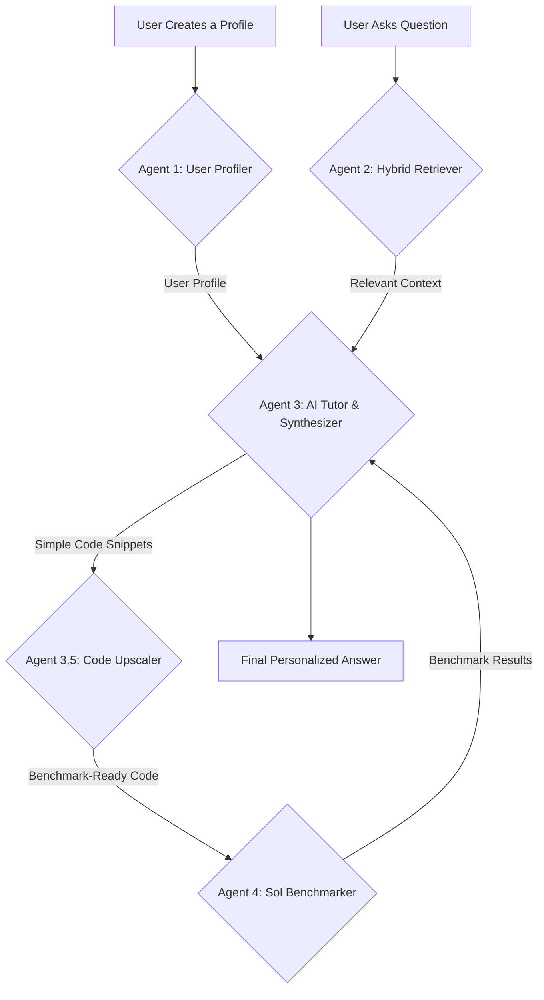

# 🤖 The AI Tutor for Data Science Enthusiasts!

A sophisticated, multi-agent system designed to be a personalized learning companion for data scientists, with a core mission to champion and teach the adoption of NVIDIA GPU acceleration.

### The Challenge

[cite\_start]The AI Accelerated Spark Challenge asks us to design an AI tutoring system that accelerates learning in data science[cite: 284]. [cite\_start]The system must ingest course content and, most importantly, incorporate and encourage the use of GPU acceleration materials provided by NVIDIA[cite: 285].

### Our Solution: An Agent-Based Architecture

We didn't just build a simple chatbot. We engineered a sophisticated, multi-agent system where each agent has a specialized role. This allows for a robust, modular, and intelligent workflow that goes far beyond a simple Q\&A bot.

Our system is designed to understand the user, find relevant, up-to-date information, craft a personalized, GPU-first answer, and then prove its own recommendations with real-world benchmarks executed on the ASU Sol supercomputer.

#### System Flowchart

This is how our agents collaborate to answer a user's question:

### What Makes Our Tutor Unique?

We've focused on a few key features that make our solution stand out:

**1. The "NVIDIA-First" Directive**
The core "brain" of our tutor (Agent 3) is governed by a simple but powerful directive: always prioritize and advocate for the NVIDIA-based solution. If a task can be accelerated with CuPy or RAPIDS, the agent is hardwired to present that solution first, framing it as the modern, high-performance standard, with the CPU method shown only as a baseline for comparison. This directly fulfills the central requirement of the hackathon.

**2. Personalized Learning Paths**
Our system doesn't give the same answer to everyone. **Agent 1 (The User Profiler)** engages the user in a quick, dynamic conversation to assess their knowledge level (Beginner, Intermediate, or Advanced). This profile is then fed to **Agent 3**, which tailors the tone, technical depth, and complexity of its explanation to match the user. A beginner gets simple analogies and encouragement, while an advanced user gets a deep dive into architecture and performance nuances.

**3. Agentic, "Just-in-Time" Benchmarking**
This is our most powerful feature. Our tutor doesn't rely on pre-existing benchmarks.

  * **Agent 3** generates both CPU and GPU code to solve the user's problem.
  * A specialized sub-agent, the **Code Upscaler**, then analyzes this code and intelligently modifies it, increasing the problem size (e.g., from a 10x10 matrix to 8000x8000) to ensure the benchmark will be meaningful.
  * **Agent 4 (The Sol Benchmarker)** takes this upscaled code, creates a SLURM batch script, and submits it as a job on the Sol supercomputer.
  * It waits for the job to complete, parses the results, and feeds the live performance data (CPU time, GPU time, Speedup Factor) back to Agent 3.
  * The final answer presented to the user includes a markdown table with real, just-generated proof of how much faster the NVIDIA solution was.

**4. Robust, Hybrid Information Retrieval**
Our **Agent 2 (The Hybrid Retriever)** is designed to be both fast and comprehensive. It first attempts to find the latest, highest-quality information from the RSS feeds of trusted sources like the NVIDIA Developer Blog. If it comes up empty, it automatically falls back to a broader, "polite" web search to ensure it can always find some relevant context, making the system resilient and knowledgeable.
