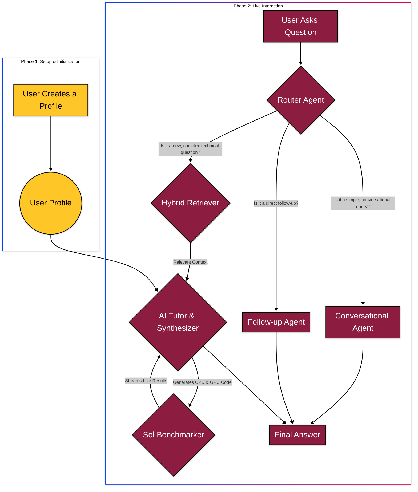

# 🤖 The AI Tutor for Data Science Enthusiasts!

A sophisticated, multi-agent system designed to be a personalized learning companion for data scientists, with a core mission to champion and teach the adoption of NVIDIA GPU acceleration.

### The Challenge

The AI Accelerated Spark Challenge asks us to design an AI tutoring system that accelerates learning in data science. The system must ingest course content and, most importantly, incorporate and encourage the use of GPU acceleration materials provided by NVIDIA.

### Our Solution: An Agent-Based Architecture

We didn't just build a simple chatbot. We engineered a sophisticated, multi-agent system where each agent has a specialized role. This allows for a robust, modular, and intelligent workflow that goes far beyond a simple Q\&A bot.

Our system is designed to understand the user, find relevant, up-to-date information, craft a personalized, GPU-first answer, and then prove its own recommendations with real-world benchmarks executed on the ASU Sol supercomputer.

#### Multi-Agent Architecture

This is how our agents collaborate to answer a user's question:

### What Makes Our Tutor Unique?

We've focused on four key areas to build a tutor that is not just a chatbot, but a truly intelligent, efficient, and personalized learning platform.

**1. Sophisticated Multi-Agent Architecture with an "Agentic Router"**

Our system is not a simple, linear pipeline. At its core is a **Router Agent** that first analyzes the user's intent. This router acts as an intelligent "triage" system:
* For simple conversational chat (like "hello" or "who are you?"), it delegates to a fast, lightweight response agent.
* Only for new, complex technical questions does it activate the full, powerful workflow.

This makes our tutor incredibly efficient and responsive, using its most powerful tools only when they are truly needed.

**2. Live, Parallel Benchmarking on the Sol Supercomputer**

This is our most powerful feature. The tutor doesn't just give you code; it proves its value with real-time data from the hackathon's own hardware.
* **Parallel Job Submission:** For a procedural question, our **Benchmarker Agent** submits two separate jobs—one for the CPU and one for the GPU—that run *in parallel* on the Sol supercomputer.
* **Live-Streaming Results:** The user doesn't have to wait. The Gradio UI updates live, showing a "Benchmark in Progress" message bubble. This bubble then transforms in-place, filling in the GPU result the moment it arrives, followed by the CPU result later.
* **Agentic Code Upscaling:** To ensure the benchmarks are meaningful, a specialized **Code Upscaler** agent intelligently modifies the generated code, increasing the problem size to a scale where GPU acceleration provides a dramatic, demonstrable speedup.

**3. Personalized & Persona-Driven Tutoring**

Our tutor adapts to its user.
* **Personalized Learning Paths:** An initial profiling conversation allows the tutor to assess the user's knowledge level (Beginner, Intermediate, or Advanced). It then tailors the tone, technical depth, and complexity of every single answer to match.
* **Built-in Persona:** The agent has a sense of self. It can handle meta-questions like "what can you do?" or "who created you?", making the interaction feel natural and engaging, not robotic.
* **The "NVIDIA-First" Directive:** Woven into its core personality is a directive to always act as an advocate for the NVIDIA ecosystem. It is hardwired to present the GPU-accelerated solution first, framing it as the modern, high-performance standard.

**4. Resilient, Three-Tiered Information Retrieval**

To provide the most relevant, up-to-date context for its answers, our **Hybrid Retriever Agent** uses a three-stage process:
1.  **Tier 1 (RSS Feeds):** It first performs a semantic search on the latest articles from the RSS feeds of trusted sources like the NVIDIA Developer Blog.
2.  **Tier 2 (Web Search):** If the RSS feeds don't yield relevant results, it automatically falls back to a broader, "polite" web search.
3.  **Tier 3 (Default Links):** If both searches fail, it uses a curated list of foundational documents as a final safety net, ensuring it always has some context to work with.
